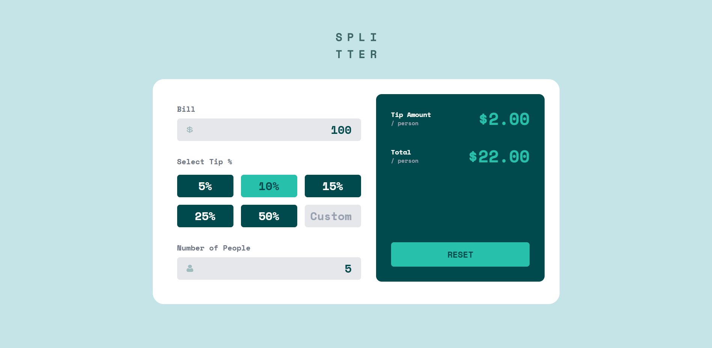
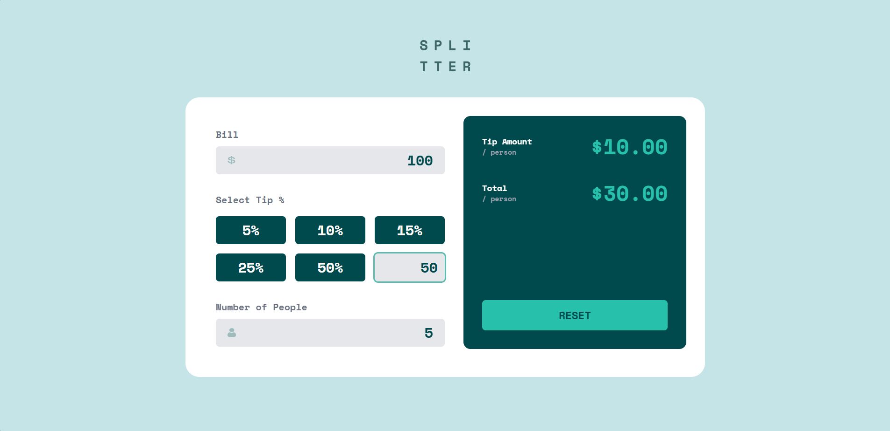

# Tip Calculator - Jimeno

This is a web application designed to help users calculate tips for restaurant bills. It provides an intuitive interface for inputting bill amounts, selecting tip percentages, and splitting the bill among multiple people.

## Description

Tip Calculator is a React-based application built with Next.js and TypeScript. It allows users to quickly calculate the appropriate tip amount and total bill cost, making dining out more convenient and transparent.

## Screenshots

The application includes screenshots that demonstrate its usage.


 


## Features

- **Tip Calculation**: Calculate tips based on percentage of the bill amount
- **Bill Splitting**: Split the total bill evenly among a specified number of people
- **Multiple Tip Options**: Choose from predefined tip percentages (10%, 15%, 20%, 25%)
- **Responsive Design**: Works on both desktop and mobile devices
- **Real-time Updates**: See calculations update as you change inputs

## Technologies Used

- **Next.js**: A React framework for server-rendered web applications
- **TypeScript**: Statically typed JavaScript superset
- **React**: JavaScript library for building user interfaces
- **Tailwind CSS**: Utility-first CSS framework for styling
- **React Context API**: State management without additional libraries
- **Node.js**: JavaScript runtime for backend operations

## Installation

To set up the project, follow these steps:

1. Clone the repository:
   ```bash
   git clone https://github.com/devcedrick/jimeno-tip-calculator.git
   cd jimeno-tip-calculator
   ```

2. Install project dependencies:
   ```bash
   npm install
   # or
   yarn install
   ```

3. Start the development server:
   ```bash
   npm run dev
   ```

## Usage

Once the development server is running, open your browser and navigate to `http://localhost:3000`. The application will automatically open if your default browser is set.

- Enter the bill amount in the input field.
- Select the number of people.
- Choose a tip percentage from the dropdown menu.
- The calculator will display the tip amount, tax (if applicable), and the total bill per person.

## Project Structure

The project follows a standard Next.js directory structure:

```
.
├── app/
│   ├── page.tsx            # Main page component
│   ├── layout.tsx          # Root layout
├── components/
│   ├── layouts/            # Layout wrappers
│   ├── ui/                 # Reusable UI components
├── context/
│   ├── TipCalcContext.tsx  # Context for state management
├── hooks/
│   ├── useTipCalculator.ts # Custom hook for calculation logic
├── lib/
│   ├── utils/
│   │   ├── calculate.ts    # Utility functions for calculations
├── public/
│   ├── screenshots/        # Static screenshot files
```
